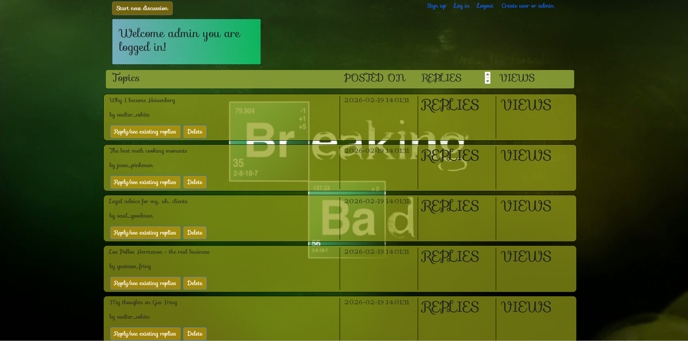

# Breaking Bad Forum

A simple forum website with **Breaking Bad** theme, built with **MySQL** and **PHP**.

## 📸 Screenshots


## 🛠️ Technologies
- **PHP** (backend)
- **MySQL** (database)
- **HTML / CSS / JavaScript**
- **Bootstrap** (styling)

## 📋 Requirements
- XAMPP / WAMP / MAMP
- PHP 7.4 or higher
- MySQL 5.7 or higher

## 🚀 Installation
1. **Clone** this repository:
   ```bash
   git clone https://github.com/your-username/forum_php.git
2. Move the files to your htdocs folder (in XAMPP)
3. Create the database:
- Open http://localhost/phpmyadmin
- Import the database.sql file
- Or create a new database named database_forum and run the queries manually
4. Configure database connection:
- Edit your database configuration file (e.g. config.php, db_connect.php)
- Set your database credentials
5. Run the project:
- Open your browser and go to http://localhost/forum_project

## 👥 Demo Users
All demo users and passwords can be found inside the database.sql file.

## 📝 Features
- User registration / login
- Create new threads
- Post replies
- User roles (admin/user)
- Breaking Bad themed design

## 🤝 Contributing
Feel free to fork this project and improve it!

## 📄 License
This project is for educational purposes.

---
Created by [Alex Vlandos](https://github.com/Alex-Vlandos)
